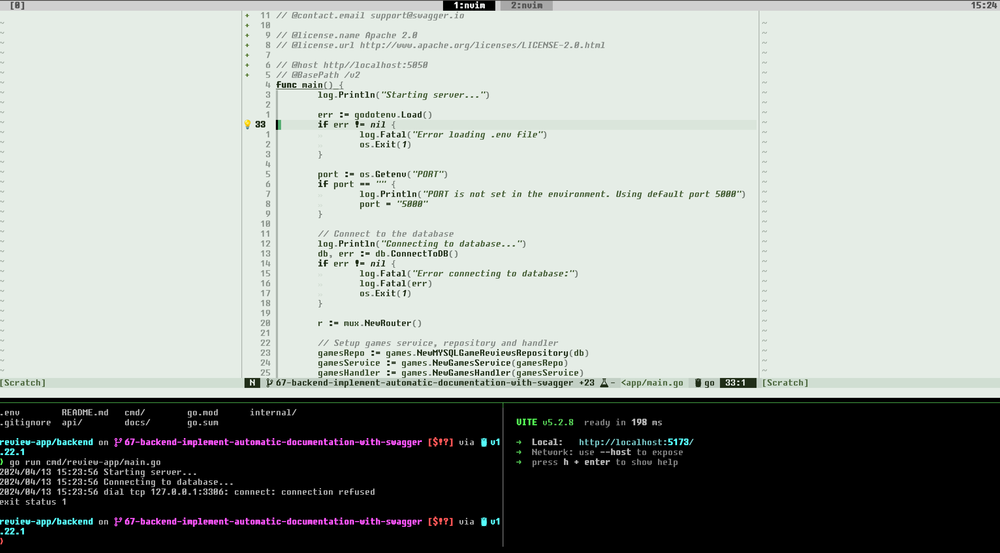

# .dotfiles

This repository contains my personal dotfiles. The dotfiles are managed using GNU Stow.

## Dependencies

| Dependency      | Description           |
| --------------- | --------------------- |
| bash            | Shell                 |
| starship        | Prompt                |
| wezterm         | Terminal              |
| tmux            | Terminal multiplexer  |
| neovim          | Text editor           |
| lazygit         | Git terminal UI       |
| fzf             | Fuzzy finder          |
| ripgrep         | Search tool           |
| stow            | Symlink farm manager  |
| sway            | Tiling window manager |
| sway-screenshot | Screenshot tool       |
| rofi            | Application launcher  |

## Screenshot

## Installation

(overwrites existing dotfiles in the home directory)

1. Install dependencies (see above)
2. `git clone https://github.com/oskarilindroos/.dotfiles.git ~/` Clone the repository
3. `cd ~/.dotfiles` Change directory to the repository
4. `stow . --adopt` Make symlinks to the home directory
5. `git reset --head` Reset the repository to remove any changes
